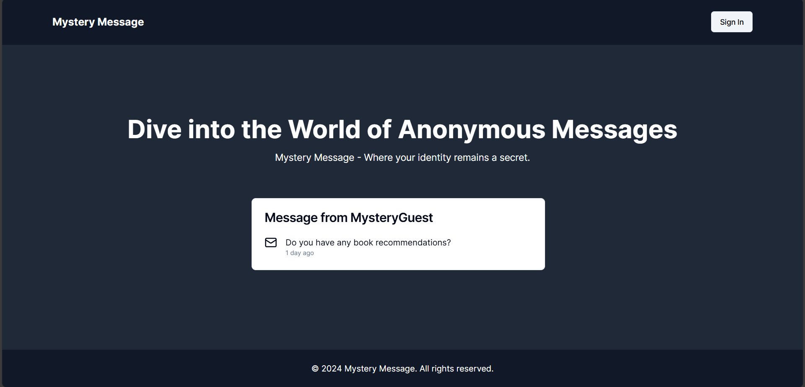
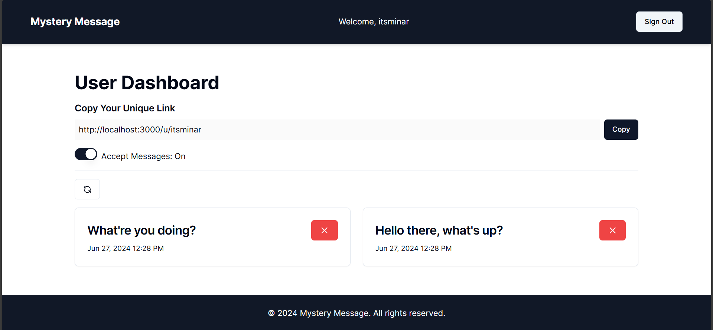
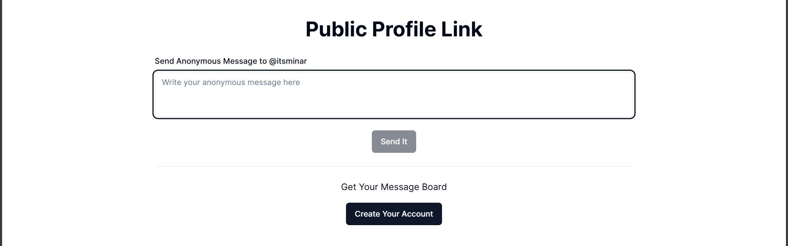

# Mystery Message

## Overview

The Mystery Message is a full stack Anonymous Messaging app that allows users to
send and receive messages without revealing their identities. The project aims
to provide a secure and anonymous way for individuals to communicate, ensuring
privacy and confidentiality.

## Features

- **Anonymous Messaging**: Send and receive messages without revealing your
  identity.
- **User-Friendly Interface**: Easy-to-use interface for seamless communication.
- **Cross-Platform**: Accessible from various devices, including desktops and
  mobile devices.

## Screenshots

Here are some screenshots of the application:

### Home Page

### Dashboard Page

### Send Message Page

